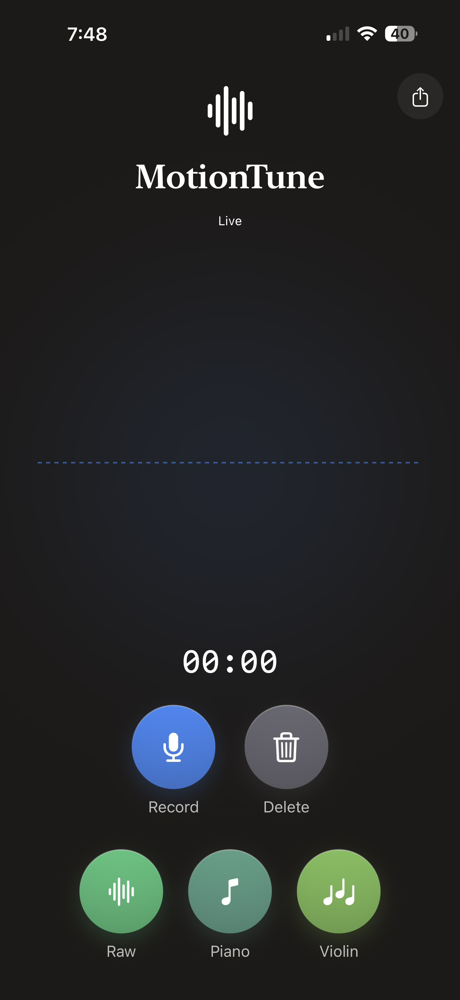
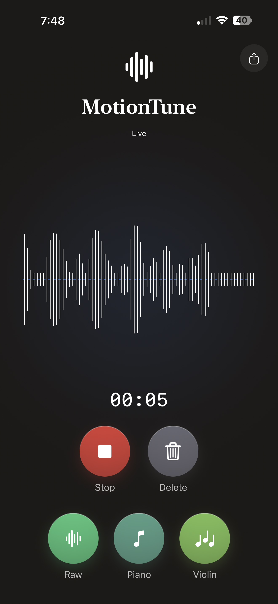
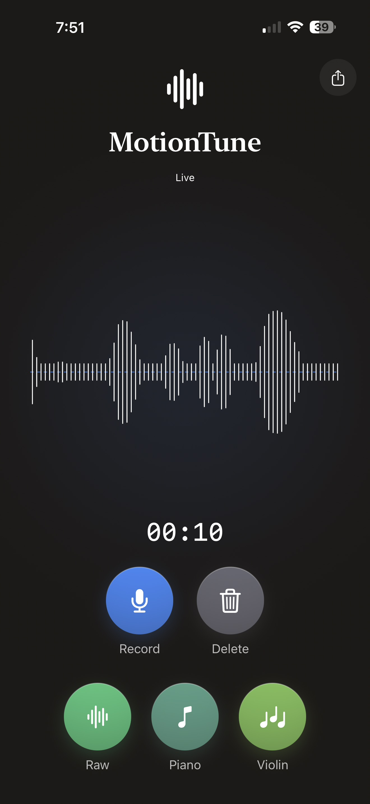
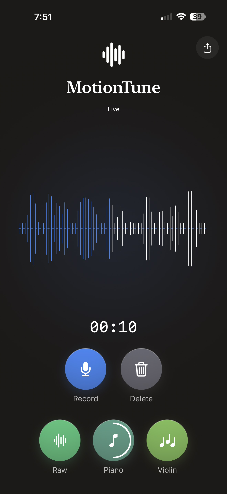
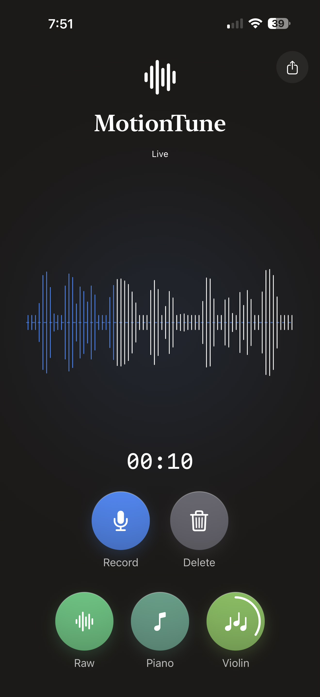
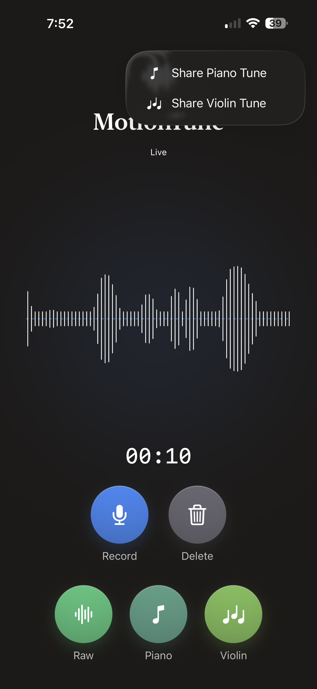

# MotionTune

Turn your phone's motion into music. Move the device like a theremin: tilt for pitch, sway for volume, rotate for vibrato — and every gesture becomes a playable, exportable MIDI melody.

<p float="left">
  
  
  
</p>
<br>
<p float="left">
  
  
  
</p>

## Introduction

MotionTune is a motion-controlled music instrument for iOS. The iPhone's built-in motion sensors replace a traditional instrument interface: instead of keys, strings, or buttons, you *perform* by moving the device in space. The app captures those gestures, maps them into three-dimensional MIDI curves (pitch, expression, and modulation), and renders them in real time as an expressive instrument — with an optional AI-refined "melody" pass that snaps the performance to a musical scale. This app is heavily inspired from the idea of '[Sonification](https://www.perkins.org/resource/sonification-sounds-meaning-activity/)'.

Everything runs on-device. Sensors are sampled locally, MIDI curves are produced locally, and inference (see [Technical implementation](#technical-implementation)) executes via SDK integration with Zetic AI — no network connection, no cloud round-trip.

## How to use the app

1. **Record** — Tap the blue record button (`mic`) and move the phone. The live waveform shows the energy of your gesture in real time.
2. **Stop** — Tap the red stop button to end the take; the waveform now shows your full recording.
3. **Delete** — Tap the trash button to discard the take and start over.
4. **Play** — Replay your performance three ways:
   - **Raw** — the exact recorded MIDI curves, played back as-is.
   - **Piano** — an AI-quantized melody, synthesized with a piano timbre.
   - **Violin** — the same quantized melody, synthesized with a violin timbre.

### The gesture vocabulary

| Sensor axis | Musical parameter | What you feel |
| --- | --- | --- |
| `attitude.pitch` + vertical acceleration | Pitch bend (14-bit, center 8192) | Tilt up/down to glide pitch |
| `gravity.y` | CC11 — expression / dynamics | Tilt the device to swell volume |
| `rotationRate.z` | CC1 — modulation / vibrato | Twist the wrist for vibrato |

## Technical implementation

```
Raw sensors (60 Hz, CoreMotion)
      │
      ▼
Normalized time series  ──  each axis scaled to 0…1 with a sensitivity
      │                    boost so small moves swing the full MIDI range
      ▼
Note segmentation + quantization  ──  gestures segmented into discrete notes
      │                            and snapped to a G-major scale
      ▼
Raw MIDI curves (3 dimensions)  ──  pitch bend (14-bit) · CC11 (expression)
      │                           · CC1 (modulation)
      ▼
Transformer + Attention (trained on Maestro)
      │
      ▼
"Good" MIDI curves  ──  musically refined, natural phrasing & dynamics
      │
      ▼
iOS audio plugins / synthesis  ──  AVAudioEngine real-time DSP rendering
```

1. **Raw sensors** — `CoreMotion` device-motion updates at 60 Hz capture `attitude.pitch`, `gravity.y`, and `rotationRate.z` (plus roll and vertical acceleration as supporting axes).
2. **Normalized time series** — Each axis is normalized to `0…1` within a tuned working range, then passed through a sensitivity boost so a modest tilt can traverse the entire MIDI range.
3. **Note segmentation + quantization** — In melody mode, the continuous gesture is segmented into notes and quantized onto a stepwise G-major ladder, with octave registration via roll and chord-weighted note snapping, giving a human-playable scale performance.
4. **Raw MIDI curves** — Three synchronized curve streams are produced: 14-bit pitch bend (centered at 8192), 7-bit CC11 expression, and 7-bit CC1 modulation.
5. **Custom AI model (Maestro-trained)** — A model trained on the [Maestro dataset](https://magenta.tensorflow.org/datasets/maestro) learns the difference between mechanical curve input and expressive piano/violin phrasing, refining the raw curves into musical output.
6. **"Good" MIDI curves** — The refined, de-noised performance curves ready for synthesis.
7. **iOS plugins / synthesis** — `AVAudioEngine` renders the curves to audio in real time via a pure-DSP source node: additive violin/piano timbres, a chord pad, and a soft-knee limiter (−6 dB) to prevent clipping. 

### Real-time on-device inference with ZETIC AI

The melody-refinement model runs entirely on-device using ZETIC Melange (formerly MLange). Melange takes the trained model, automatically compiles and quantizes it for the Apple Neural Engine, and exposes a simple Swift API — the raw curves go in, the "good" curves come out, and no data ever leaves the device. Model binaries are downloaded once and cached; inference executes on the NPU with zero-copy memory mapping.

### Model deployment pipeline

1. **Train** — the CurveTransformer model is trained offline (see `training/`) and exported as a CPU-safe PyTorch Exported Program (`.pt2`), along with a sample input `.npy` file defining the fixed input shape.
2. **Upload** — the `.pt2` and sample input are uploaded to the [Zetic Melange Dashboard](https://mlange.zetic.ai), which compiles the model into a static NPU-targeted graph.
3. **Optimize** — Melange benchmarks the compiled model across real devices to select the best-performing binary per hardware target.
4. **Integrate** — once optimization completes, the model is available via the `ZeticMLangeiOS` SDK, referenced by name/version:
```swift
   let model = try ZeticMLangeModel(
       personalKey: PERSONAL_KEY,
       name: "twinkledhanak/MotionTune",
       version: 4,
       modelMode: .RUN_AUTO
   )
```
5. **Run inference** — at runtime, the app loads the compiled binary automatically and runs it directly on the Neural Engine, no manual conversion step needed on-device.

**References (ZETIC Melange):**
- [ZETIC Melange — documentation home](https://docs.zetic.ai/)
- [iOS setup guide](https://docs.zetic.ai/platform-integration/ios/setup)
- [Running basic inference on iOS](https://docs.zetic.ai/platform-integration/ios/basic-inference)
- [Advanced configuration (inference modes)](https://docs.zetic.ai/platform-integration/ios/advanced-configuration)
- [`ZeticMLangeModel` — iOS API reference](https://docs.zetic.ai/api-reference/ios/ZeticMLangeModel)
- [ZeticMLangeiOS — Swift package (SPM)](https://github.com/zetic-ai/ZeticMLangeiOS)
- [ZETIC Melange sample apps](https://github.com/zetic-ai/ZETIC_Melange_apps)

